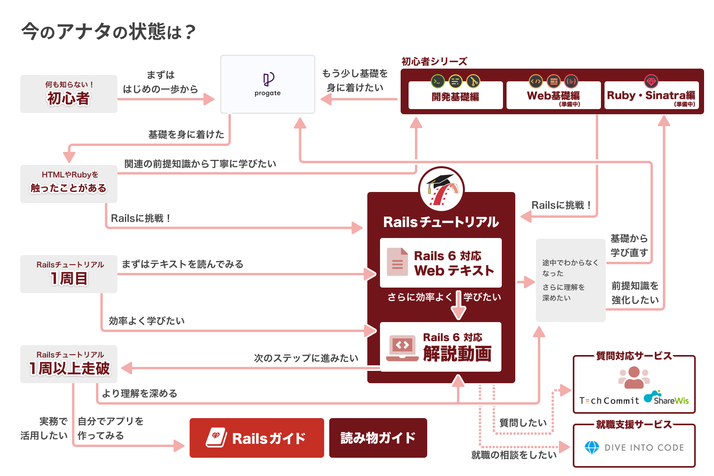
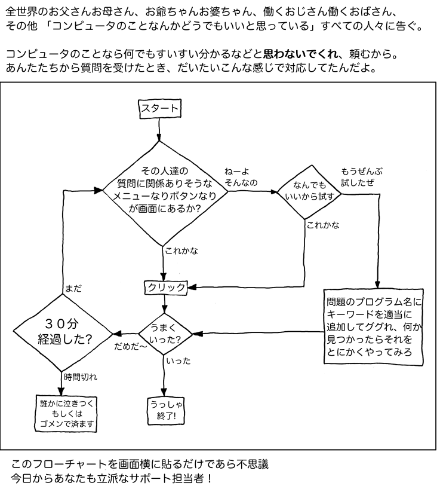
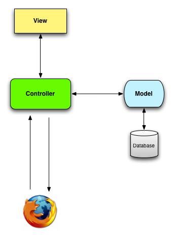
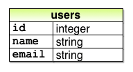
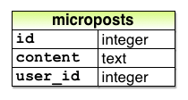
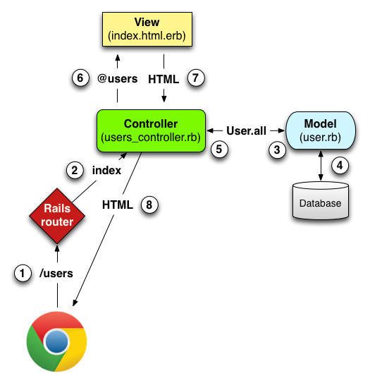

# From Zero to Deployment

- Ruby on Rails(Rails) is free and OpenSource Web deployment framework written in the Ruby programming language.
- Rails has rapidly become famous as a tool for developing full-scale Web-serveces, and has been adopted not only by world-famous companies such as [GitHub](https://github.co.jp/), [Airbnb](https://www.airbnb.jp/), [SoundCloud](https://ja.wikipedia.org/wiki/SoundCloud), [Disney](https://www.disney.co.jp/), [Hulu](https://www.hulu.jp/), and [Shopify](https://www.shopify.jp/), but also by services such as [note](https://note.com/), [Cookpad](https://cookpad.com/), [Progate](https://prog-8.com/?utm_source=rails_tutorial), and [Qiita](https://qiita.com/) in Japan.

- Rails6 is addition to [email routing] and [rich text features], and introduces new advanced features such as [parallel test] and [support for multiple databases].

## Prerequisite knowledge




## Try to move it

### What does it mean to be "Proficient"?



### Develptment environment

- Using Cloud9(AWS) as a development environment

### Installing Rails

> Configuration the `.gemrc` file not to install the Ruby document.

`$ echo "gem: --no-document" >> ~/.gemrc`

> Installing Rails with a specific version

`$ gem install rails -v 6.0.3`

### First application

- create a simple application that displays the string "hello world!" on a web page

> Running `rails new`(specifiying the version number)

`rails _6.1.3.2\_ new hello_app`

> The Directory structure of a newly created Rails application

| **ディレクトリ** | **用途**                                                     |
| ---------------- | ------------------------------------------------------------ |
| `app/`           | Application code including Model, View, Controller, Helper etc |
| `app/assets`     | CSS(Cascading Style Sheet), JavaScript file, image and other assets |
| `bin/`           | binary executable file                                       |
| `config/`        | Application Settings                                         |
| `db/`            | Database-related files                                       |
| `doc/`           | Documantation for application, including manual              |
| `lib/`           | Library and module repository                                |
| `log/`           | Application log file                                         |
| `public/`        | Data that is directly exposed to the public(e.g. web browsers), such as error pages |
| `bin/rails`      | Rails scripts used for code generation, starting the console, launching the local web server, etc |
| `test/`          | Testing the Application                                      |
| `tmp/`           | Tempolary file                                               |
| `README.md`      | A brief description of the application                       |
| `Gemfile`        | Definition file of Gem required for the application          |
| `Gemfile.lock`   | a list to check the version of the gem used in application   |
| `config.ru`      | Configuration file for [Rack middleware](https://rack.github.io/) |
| `.gitignore`     | Patterns for specifying which files you don't want to include in Git |

### bundler

> Reflash the contents of the Gemfile

```ruby
source 'https://rubygems.org'
git_source(:github) { |repo| "https://github.com/#{repo}.git" }

ruby '3.0.1'

gem 'rails',			'~> 6.1.3', '>= 6.1.3.2'
gem 'sqlite3', 		'~> 1.4'
gem 'puma', 			'~> 5.0'
gem 'sass-rails', '>= 6'
gem 'webpacker', 	'~> 5.0'
gem 'turbolinks', '~> 5'
gem 'jbuilder', 	'~> 2.7'

# Use Redis adapter to run Action Cable in production
# gem 'redis', '~> 4.0'
# Use Active Model has_secure_password
# gem 'bcrypt', '~> 3.1.7'
# Use Active Storage variant
# gem 'image_processing', '~> 1.2'

gem 'bootsnap', '>= 1.4.4', require: false

group :development, :test do
	gem 'sqlite3', '~> 1.4'
  gem 'byebug', platforms: [:mri, :mingw, :x64_mingw]
end

group :development do
  gem 'web-console', '>= 4.1.0'
  gem 'rack-mini-profiler', '~> 2.0'
  gem 'listen', '~> 3.3'
  gem 'spring'
end

group :test do
  gem 'capybara', '>= 3.26'
  gem 'selenium-webdriver'
  gem 'webdrivers'
end
```

> Installing Gems

`$ bundle install`

### Model-View-Controller (MVC)



### Hello, world!

> Add `hello` to Application controller

```ruby
class ApplicationController < Actioncontroller::Base
  
  def hello
    render html: "hello world!"
  end
end
```

> Settings root routing

```ruby
Rails.application.routes.draw do
	root 'application#hello'
end
```

## Version Control with Git

- Benefits
  - You can follow the code history of a project
  - You can rollback files that have been accidentally deleted

### Install and Setup

> Settings Your name and email in Git

```shell
$ git config --global user.name "Your name"
$ git config --global user.email YOUR_EMAIL_ADDRESS
```

> Settings `git co` in check out aliases

`git config --global alias.co checkout`

> Settings Git to Retain Passwords for a Certain Amount of Time

`git config --global credential.helper "cache --timeout=86400"`

## Deploying

- Heroku is hosting platforms for Ruby web apps including Rails

### Setting up and deploying Heroku

> `Gemfile` with additions and sorting

```ruby
source 'https://rubygems.org'
...
group :production do
	gem 'pg', '~> 1.2', '>= 1.2.3'
end
```

> installing a non-production gem

`bundle install --without production`

> Create new application to Heroku

`heroku create`

# Toy Application

- Using scaffold generator
- Consider the REST(Representasional State Transfer) architecture

#### The sweet temptation of Scaffold is too easy.

- `scaffold` is very userful, but useless

## Planning the Application

### Designing Model of the user

> The user data model 



### Designing Model of the Micropost

> The micropost data model



## Users resource

- Users resource can be regarded as an object that can be freely post/get/update/delete via the HTTP protocol

> Creating a users resource using scaffold

`rails generate scaffold User name:string email:string`

> Migrating database

`rails db:migrate`

## Exploring the user page

| **URL**       | **Action** | **Purpose**                          |
| ------------- | ---------- | ------------------------------------ |
| /users        | `index`    | Page to list all users               |
| /users/1      | `show`     | Page to display the user with id=`1` |
| /users/new    | `new`      | Page to create a new user            |
| /users/1/edit | `edit`     | Page to edit the user with id=`1`    |

## MVC Behavior

1. Send request from brower to the Rails server with the URL "/users"
2. "/users" request will be assigned to the index action in the Users controller by the Rails routing structure
3. Running index action and from there it queries the User model to "retrieve all users"(`User.all`) 
4. The User model receives a query and retrieves all users from the database
5. return the list of users retrieved from the database form the User model to the controller
6. The Users controller stores the list of users in the @users variable and passes it to the index view
7. The index view will be launched, and the ERB(Embedded Ruby) vill be executed to generate the HTML
8. The controler takes HTML generated by the view and returns it to the browser



> Roles for the Users resource used in the Rails root
>
> Add Routes from Root to Users

```ruby
Rails.application.routes.draw do
  resources :users
  root 'users#index'
end
```

> The Users controller framework

```ruby
class UsersController < ApplicationController
  def index
  end
  
  def show
  end
  
  def new
  end
  
  def edit
  end
  
  def create
  end
  
  def update
  end
  
  def destroy
  end
end
```

- REpresentational State Transfer(REST)
  - REST is one of the architectual styles for building distributed and networked systems and applications, such as the Internet itself and web applications

> Concise User  `index` action in the Toy Application

```ruby
class UsersController < ApplicationController
  def index
    @users = User.all
  end
end
```

> User Model in the Toy Application

```ruby
class User < ApplicationRecord
end
```

> View Corresponding to the index Action

```erb
<h1>Users</h1>

<tbody>
	<% @user.each do |user| %>
  	<tr>
  		<td><%= user.name %></td>
      <td><%= user.email %></td>
      <td><%= link_to 'Show', user %></td>
      <td><%= link_to 'Edit', edit_user_path(user) %></td>
      <td><%= link_to 'Destroy', user, method: :delete, 
											 data: { confirm: 'Are you sure?' } %></td>
  	</tr>
  <% end %>
</tbody>
```

### Drawbacks of Users resource

